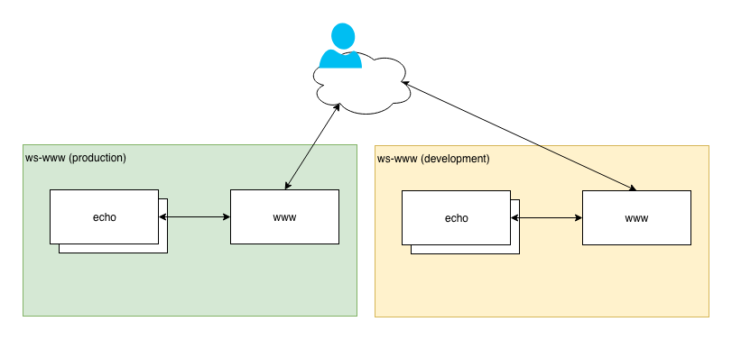

# Radix Workshop - Example 1 (WWW & Echo)

Purpose - a simple two module app. The public front-end (www) will respond to requests, request data from the non-public echo module - and echo the data back to the requestor. All magic!

## Content

- ```echo``` contains the echo module
- ```www``` contains the www front-end
- ```docs``` contains the workshop script ([link](./docs/workshop.md))

## A conceptual overview of the application.


